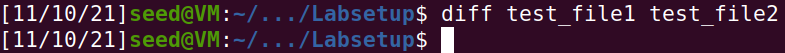

# 

## 2.1 - Task 1: Manipulating Environment Variables
****

Com os comandos *printenv* e *env* é possivel listar todas as variáveis ambiente do sistema operativo ou uma em particular sem ser necessário root access. Adicionalmente, pode-se criar e modificar variáveis sem qualquer permissão, usando *export* e eliminá-las usando o *unset*. Sendo que estas mudanças se aplicam apenas durante a execução da shell.

<!--Cortar image ou colocar o code piece-->

## 2.2 - Task 2: Passing Environment Variables from Parent Process to Child Process
****

Seguindo os passos da task que mandavam alterar o código do programa **myprintenv.c** . Ao guardar as variáveis do parent process e do child process em dois ficheiros diferentes permitiu-nos comparar as diferenças entre os dois usando o comando  *diff* e assim concluir que as variáveis ambiente são herdadas pelo processo filho do processo pai.

## 2.3 - Task 3: Environment Variables and execve()
****

A funçao execve tem 3 argumentos
+ pathname , um executável binário 
+ argv , array de apontadores para strings passados para o novo programa como argumentos da linha de comandos
+ envp , array de apontadores para strings que são passados como ambiente do novo programa

        int execve(const char *pathname, char *const argv[],char *const envp[]);

No passo 1, ao chamar bin/env passando NULL no array de apontadores para as variáveis ambientes não imprime nada.

No passo 2, ao chamar bin/env são listadas as variávies ambiente do sistema operativo, recebidas no terceiro argumento pela variavel (*environ*).

Podemos concluir que as variaveis ambiente não são automaticamente herdadas, sendo o uso do environ necessário no processo de herança.

## 2.4 - Task 4: Environment Variables and system()
****

Execve é mais perigosa porque tem mais controlo
Conseguimos facilmente verificar que o programa da tarefa 2.3 tem o mesmo resultado desta tarefa, uma vez que a função *system()* chama a função execl e esta chama o execve passando-lhe as variáveis ambiente atuais, tal como na tarefa 2.3 com o environ.

## 2.5 - Task 5: Environment Variable and Set-UID Programs
****
Tal como no exercício 3, chegamos a conclusão que as variáveis ambiente são herdadas do processo para o filho. Quando a função SET-UID faz uma “system call” as variáveis ambiente da função são usadas agora na execução da função chamada. Surpreendentemente o user consegue manipular as varáveis ambiente que o SET-UID utiliza sem ter e ser root o que poderá trazer problemas.

## 2.6 - Task 6: The PATH Environment Variable and Set-UID Programs
****

Usando o que aprendemos nas tasks anteriores podemos correr indevidamente o nosso código com permissões de root usando programas Set-UID e chamadas ao sistemas. Para fazer isso, tivemos de mudar a variável ambiente PATH para incluir no inicio a nossa PWD isto porque o system chama ls com um path relativo que usa a variável PATH para encontrar a função correta no bin. O que acontece vai primeiro verificar a nossa PWD e se tivermos um programa do mesmo nome ls irá executar essa função e não a devida e além disso, com permissões de root.

## CTF - Semana 4: Web
****

Este CTF consiste em descobrir-mos uma vulnerabilidade no site que nos permita ganhar acesso ao administrador. Através de uma leve exploração do site, descobrimos que este usa um puglin **Booster for Woocommerce** que esta desatualizado com a versão 5.4.3. Se procurarmos por essa versão na Internet chegamos á pagina do Exploit-db que nos leva a descobrir que o site tem a vulnerabilidade CVE-2021-34646, que é a solução para o Desafio1. Para o Desafio2, basta copiar o codigo do Exploit-db e executar. Este gera varios links que nos permitem ganhar acesso à conta do admin. Podemos agora aceder ao post "edit.php" que nos indica a password e a flag para o Desafio2.
