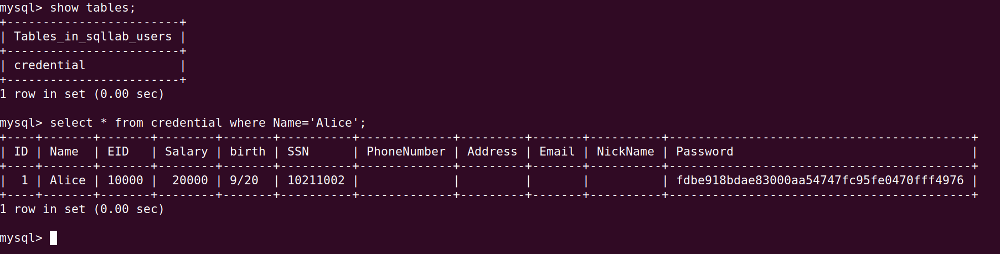
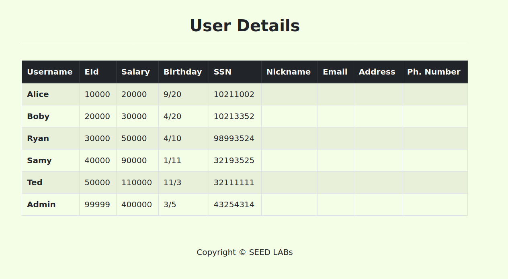
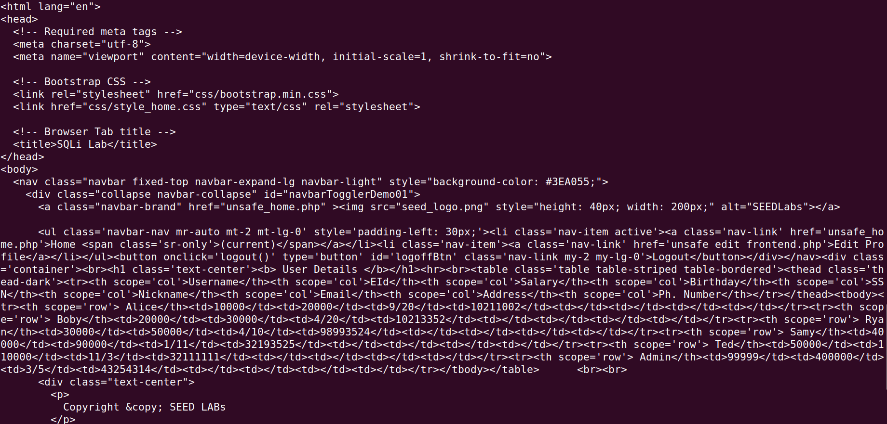
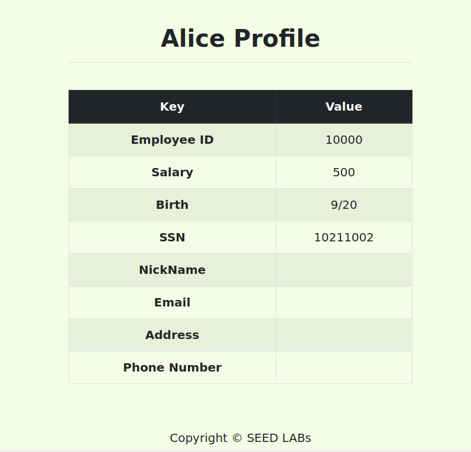
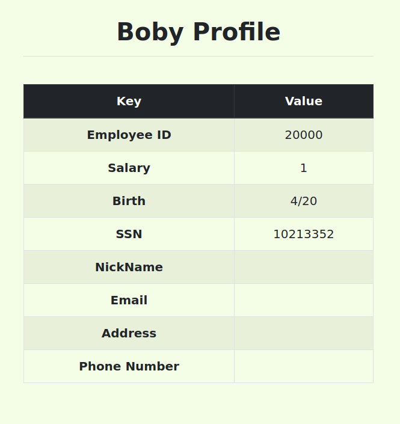

### *Task 1: Get Familiar with SQL Statements*

Para obter a informação do utilizador Alice executamos a seguinte query:

```sql
SELECT * FROM credential WHERE Name = 'Alice';
```
e obtivémos o seguinte resultado:

### *Task 2: SQL Injection Attack on SELECT Statement*

#### *Task 2.1: SQL Injection Attack from webpage.*
Para listar a informação sobre os utilizadores, submetemos os seguintes dados:

USERNAME: admin'#
PASSWORD:

E obtivémos o seguinte resultado:


#### *Task 2.2: SQL Injection Attack from command line.*

Para listar a informação sobre os utilizadores a partir do terminal, executamos o seguinte comando: 

```sh
curl 'www.seed-server.com/unsafe_home.php?username=Admin%27;%23&Password=a'
````
Como o terminal não permite usar carateres especiais (como, por exemplo '#') tivemos de usar a *tabular format* correspondente ("''" -> %27 ; "#" -> %23).

E obtivémos o seguinte resultado:



#### *Task 2.3: Append a new SQL statement.*

A injeção de multi statements no SQL não é permitida pelo PHP, pois a sua extensão de 
mySql não permite queries múltiplas numa única string. Esta limitação pode ser contornada usando multiquery().

#### *Task 3.1: Modify your own salary.*

Para alterar o salário da Alice, entramos na conta da Alice, selecionamos o *Edit Profile* e submetemos o seguinte dados no nickname:

```php
' , salary=500 where name='Alice';#
```




#### *Task 3.2: Modify other people’ password.*

Para alterar o salário da Boby, entramos na conta da Alice , selecionamos o *Edit Profile* e submetemos o seguinte dados no nickname:

```php
' , salary=1 where name='Boby';#
```

